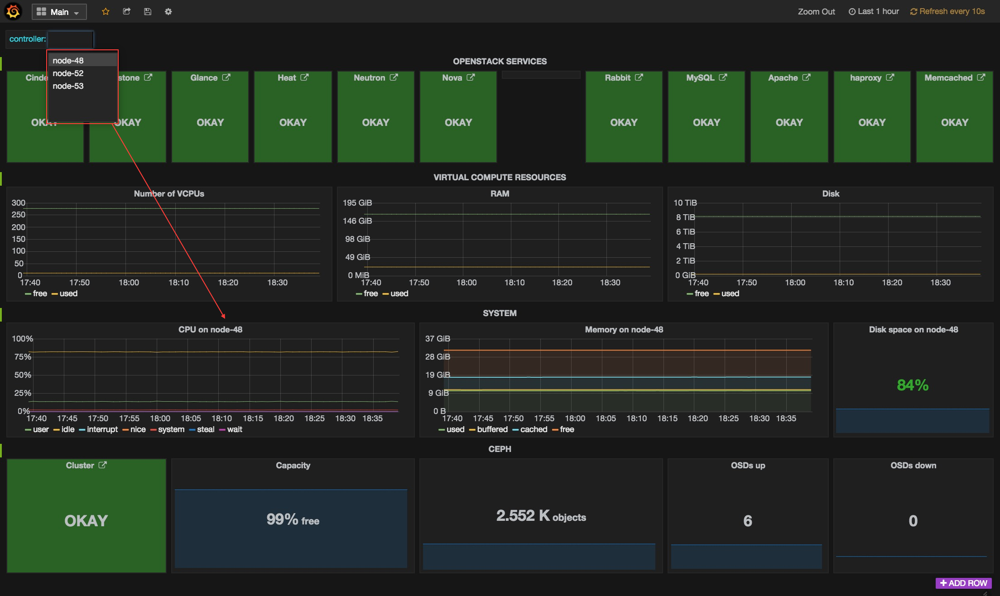
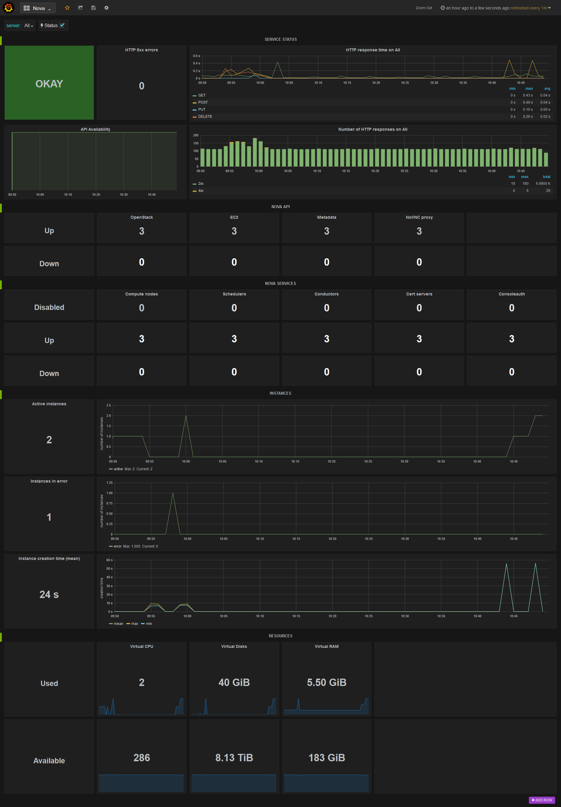
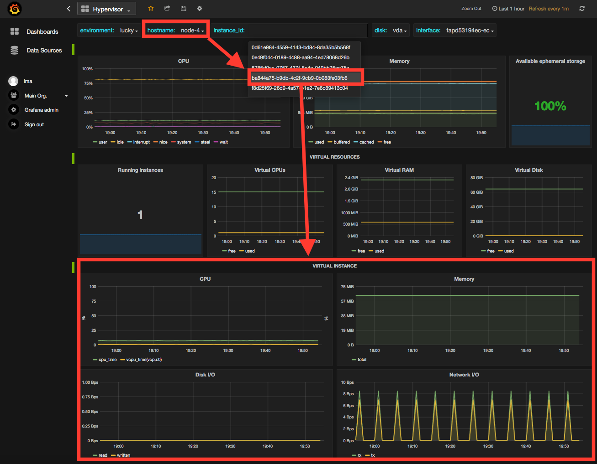
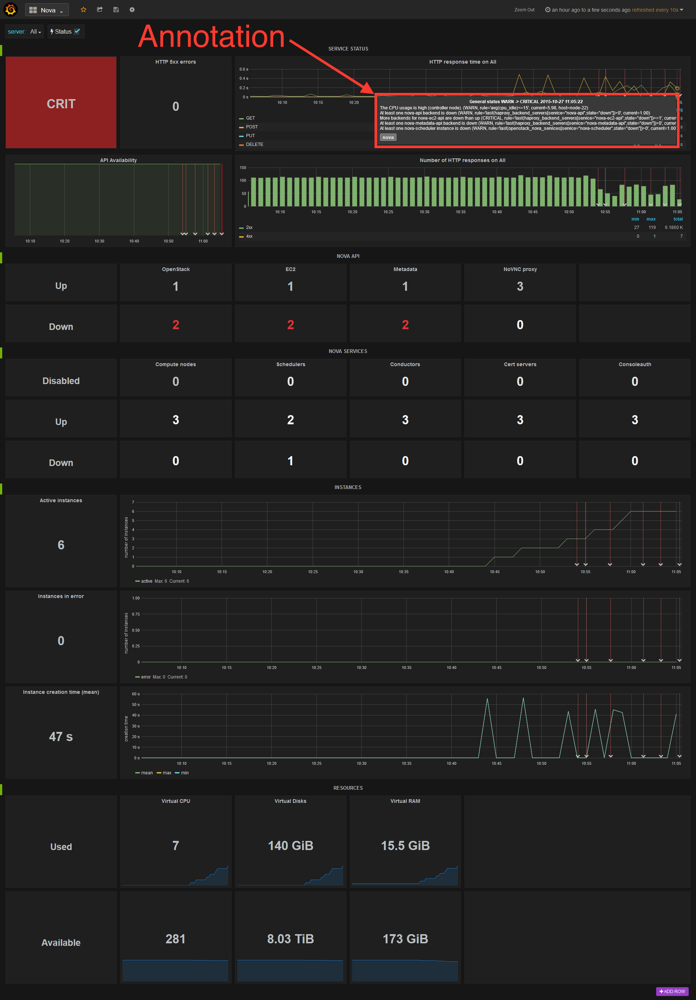
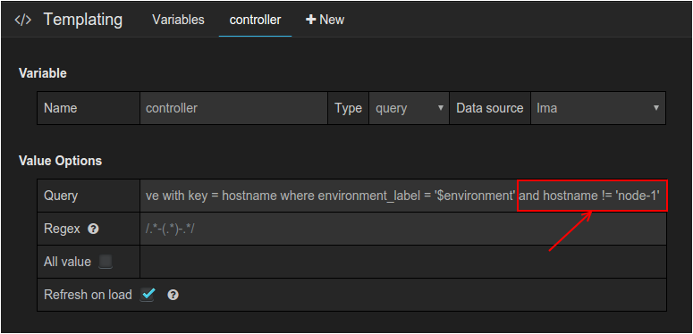

.. _usage:

Exploring your time-series with Grafana
---------------------------------------

The InfluxDB-Grafana Plugin comes with a collection of predefined dashboards
you can use to visualize the time-series stored in InfluxDB.

For a complete list of all the metrics time-series that are collected and
stored in InfluxDB, see the `List of metrics` section of the
`StackLight Collector documentation <http://fuel-plugin-lma-collector.readthedocs.org/en/latest/>`_.

The Main dashboard
++++++++++++++++++

We recommend that you start with the **Main dashboard**, as shown below, as an
entry to other dashboards. The **Main dashboard** provides a single pane of
glass from where you can visualize the overall health status of your OpenStack
services, such as Nova, Cinder, HAProxy, MySQL, RabbitMQ, and others.

The **Main dashboard**, like most dashboards, provides a drop-down menu in the
upper left corner from where you can pick a particular metric dimension, such
as the *controller name* or the *device name* you want to select.

In the example above, the dashboard displays the system metrics of *node-48*.

Within the **OpenStack Services** section, each of the services represented
can be assigned five different statuses.

.. note:: The precise determination of a service health status depends on the
   correlation policies implemented for that service by a Global Status
   Evaluation (GSE) plugin. See the `Configuring alarms` section in the
   `StackLight Collector documentation <http://fuel-plugin-lma-collector.readthedocs.org/en/latest/>`_.

The service health statuses can be as follows:

* **Down**: One or several primary functions of a service cluster has failed.
  For example, all API endpoints of a service cluster like Nova or Cinder
  failed.
* **Critical**: One or several primary functions of a service cluster are
  severely degraded. The quality of service delivered to the end user is
  severely impacted.
* **Warning**: One or several primary functions of a service cluster are
  slightly degraded. The quality of service delivered to the end user is
  slightly impacted.
* **Unknown**: There is not enough data to infer the actual health status of a
  service cluster.
* **Okay**: None of the above was found to be true.

The **Virtual compute resources** section provides an overview of the amount
of virtual resources being used by the compute nodes including the number of
virtual CPUs, the amount of memory and disk space being used, as well as the
amount of virtual resources remaining available to create new instances.

The **System** section provides an overview of the amount of physical
resources being used on the control plane (the controller cluster). You can
select a specific controller using the controller's drop-down list in the left
corner of the toolbar.

The **Ceph** section provides an overview of the resources usage and current
health status of the Ceph cluster when it is deployed in the OpenStack
environment.

The **Main dashboard** is also an entry point to access more detailed
dashboards for each of the OpenStack services that are monitored. For example,
if you click the **Nova** box, the **Nova dashboard** is displayed.

The Nova dashboard
++++++++++++++++++

The **Nova** dashboard provides a detailed view of the Nova service's related
metrics and consists of the following sections:

**Service status** -- information about the Nova service cluster
overall health status, including the status of the API front end (the HAProxy
public VIP), a counter of HTTP 5xx errors, the HTTP requests response time and
status code.

**Nova API** -- information about the current health status of the API
back ends, for example, nova-api, ec2-api, and others.

**Nova services** -- information about the current and historical status
of the Nova *workers*.

**Instances** -- information about the number of active instances in
error and instances creation time statistics.

**Resources** -- various virtual resources usage indicators.

Self-monitoring dashboards
++++++++++++++++++++++++++

The **Self-Monitoring** dashboard brings operational insights about the
overall monitoring system (the toolchain) performance. It provides information
about the *hekad* and *collectd* processes. In particular, the
**Self-Monitoring** dashboard provides information about the amount of system
resources consumed by these processes, the time allocated to the Lua plugins
running within *hekad*, the number of messages being processed, and the time
it takes to process those messages.

You can select a particular node view using the drop-down menu.

Since StackLight 0.9, there are two new dashboards:

* The **Elasticsearch Cluster** dashboard provides information about the
  overall health status of the Elasticsearch cluster including the state of
  the shards, the number of pending tasks, and various resources usage metrics.

* The **InfluxDB Cluster** dashboard provides statistics about the InfluxDB
  processes running in the InfluxDB cluster including various resources usage
  metrics.

The hypervisor dashboard
++++++++++++++++++++++++

The **Hypervisor** dashboard brings operational insights about the virtual
instances managed through *libvirt*. As shown in the figure below, the
**Hypervisor** dashboard assembles a view of various *libvirt* metrics. Use
the drop-down menu to pick a particular instance UUID running on a particular
node. The example below shows the metrics for the instance ID
``ba844a75-b9db-4c2f-9cb9-0b083fe03fb7`` running on *node-4*.

For additional information on the *libvirt* metrics that are displayed in the
**Hypervisor** dashboard, see the `List of metrics` section of the
`StackLight Collector documentation <http://fuel-plugin-lma-collector.readthedocs.org/en/latest/>`_.

Other dashboards
++++++++++++++++

There are 19 different dashboards in total that you can use to explore
different time-series facets of your OpenStack environment.

Viewing faults and anomalies
++++++++++++++++++++++++++++

The LMA Toolchain is capable of detecting a number of service-affecting
conditions, such as the faults and anomalies that occurred in your OpenStack
environment. These conditions are reported in annotations that are displayed in
Grafana. The Grafana annotations contain a textual representation of the alarm
(or set of alarms) that were triggered by the Collectors for a service.
In other words, the annotations contain valuable insights that you can use to
diagnose and troubleshoot issues. Furthermore, with the Grafana annotations,
the system makes a distinction between what is estimated as a direct root
cause versus what is estimated as an indirect root cause. This is internally
represented in a dependency graph. There are first degree dependencies used to
describe situations, whereby the health status of an entity strictly depends on
the health status of another entity. For example, Nova as a service has
first-degree dependencies with the nova-api endpoints and the nova-scheduler
workers. But there are also second-degree dependencies, whereby the health
status of an entity does not strictly depend on the health status of another
entity, although it might, depending on other operations being performed. For
example, by default, we declared that Nova has a second-degree dependency with
Neutron. As a result, the health status of Nova will not be directly impacted
by the health status of Neutron, but the annotation will provide a root cause
analysis hint. Consider a situation where Nova has changed from *okay* to
the *critical* status (because of 5xx HTTP errors) and that Neutron has been
in the *down* status for a while. In this case, the Nova dashboard will
display an annotation showing that Nova has changed to a *warning* status
because the system has detected 5xx errors and that it may be due to the fact
that Neutron is *down*. Below is an example of an annotation, which shows that
the health status of Nova is *down* because there is no *nova-api* service
back end (viewed from HAProxy) that is *up*.

Hiding nodes from dashboards
++++++++++++++++++++++++++++

When you remove a node from the environment, it is still displayed in the
:guilabel:`server` and :guilabel:`controller` drop-down lists. To hide it from
the list, edit the associated InfluxDB query in the *Templating* section. For
example, if you want to remove *node-1*, add the following condition to the
*where* clause::

    and hostname != 'node-1'

To hide more than one node, add more conditions. For example::

    and hostname != 'node-1' and hostname != 'node-2'

Perform these actions for all dashboards that display the deleted node and
save them afterward.