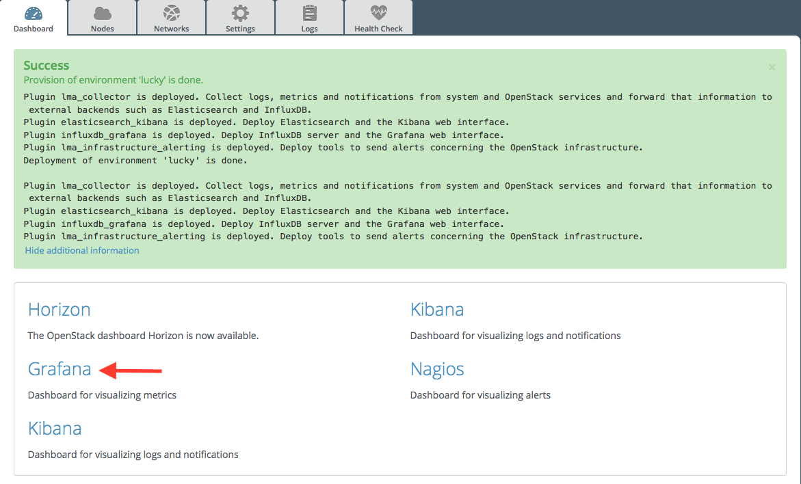

.. _user_guide:

User Guide
==========

.. _plugin_configuration:

Plugin configuration
--------------------

To configure the plugin, you need to follow these steps:

#. `Create a new environment <http://docs.mirantis.com/openstack/fuel/fuel-8.0/user-guide.html#launch-wizard-to-create-new-environment>`_
   from the Fuel web user interface.

#. Click the **Settings** tab and select the **Other** category.

#. Scroll down through the settings until you find the **InfluxDB-Grafana Server
   Plugin** section. You should see a page like this

   .. image:: ../images/influx_grafana_settings.png
      :width: 800
      :align: center

#. Check the **InfluxDB-Grafana Plugin** box and fill-in the required fields as indicated below.

   a. Specify the number of days of retention for your data.
   b. Specify the InfluxDB admin password (called root password in the InfluxDB documentation).
   c. Specify the database name (default is lma).
   d. Specify the InfluxDB username and password.
   e. Specify the Grafana username and password.

#. With the introduction of Grafana 2.6.0, the plugin now uses a MySQL database
   to store its configuration such as the dashboard templates.

   a. Select **Local MySQL** if you want to create the Grafana database using the MySQL server
      of the OpenStack control-plane. Otherwise, select **Remote server** and specify
      the fully qualified name or IP address of the MySQL server you want to use. 
   b. Then, specify the MySQL database name, username and password that will be used
      to access that database.

#. Scroll down to the bottom of the page and click the **Save Settings** button when
   you are done with the settings. 

#. Assign the *InfluxDB_Grafana* role to either one node (no HA) or three nodes if
   you want to run the InfluxDB and Grafana servers in an HA cluster.
   Note that installing the InfluxDB and Grafana servers on more than three nodes is currently
   not possible. Similarly, installing the InfluxDB and Grafana servers on two nodes
   only is not recommended to avoid a split-brain in the raft consensus used
   by the InfluxDB cluster. To be also noted, that it is possible to add a new node
   with the *InfluxDB_Grafana* role in the cluster after deployment.

   .. image:: ../images/influx_grafana_role.png
      :width: 800
      :align: center

   .. note:: You can see in the example above that the *InfluxDB_Grafana* role is assigned to
      three different nodes along with the *Infrastructure_Alerting* role and the *Elasticsearch_Kibana*
      role. This means that the three plugins of the LMA toolchain can be installed on the same nodes. 

#. Clik on **Apply Changes**

#. Adjust the disk configuration for your plugin if necessary (see the `Fuel User Guide
   <http://docs.mirantis.com/openstack/fuel/fuel-8.0/user-guide.html#disk-partitioning>`_
   for details). By default, the InfluxDB-Grafana Plugin allocates:

   - 20% of the first available disk for the operating system by honoring a range of 15GB minimum to 50GB maximum.
   - 10GB for */var/log*.
   - At least 30 GB for the InfluxDB database in */opt/influxdb*.

#. `Configure your environment <http://docs.mirantis.com/openstack/fuel/fuel-8.0/user-guide.html#configure-your-environment>`_
   as needed.

#. `Verify the networks <http://docs.mirantis.com/openstack/fuel/fuel-8.0/user-guide.html#verify-networks>`_.

#. And finaly, `deploy <http://docs.mirantis.com/openstack/fuel/fuel-8.0/user-guide.html#deploy-changes>`_ your changes.

.. _plugin_install_verification:

Plugin verification
-------------------

Be aware that depending on the number of nodes and deployment setup,
deploying a Mirantis OpenStack environment can typically take anything
from 30 minutes to several hours. But once your deployment is complete,
you should see a notification message indicating that you deployment is complete
like in the figure below.

.. image:: ../images/deployment_notification.png
   :width: 800
   :align: center

Verifying InfluxDB
~~~~~~~~~~~~~~~~~~

You should verify that the InfluxDB cluster is running properly.
To do that, you need first to retreive the InfluxDB cluster VIP.
Here is how to proceed.

#. On the Fuel Master node, find the IP address of a node where the InfluxDB
   server is installed using the folloing command::

    [root@fuel ~]# fuel nodes
    id | status   | name             | cluster | ip         | mac               | roles                 |
    ---|----------|------------------|---------|------------|-------------------|-----------------------|
    1  | ready    | Untitled (fa:87) | 1       | 10.109.0.8 | 64:18:ef:86:fa:87 | influxdb_grafana, ... |
    2  | ready    | Untitled (12:aa) | 1       | 10.109.0.3 | 64:5f:c6:88:12:aa | influxdb_grafana, ... |
    3  | ready    | Untitled (4e:6e) | 1       | 10.109.0.7 | 64:ca:bf:a4:4e:6e | influxdb_grafana, ... |

#. Then `ssh` to anyone of these nodes (ex. *node-1*) and type the command::

    root@node-1:~# hiera lma::influxdb::vip"
    10.109.1.4

  This tells you that the VIP of your InfluxDB cluster is *10.109.1.4*.

#. With that VIP type the command::

     root@node-1:~# /usr/bin/influx -database lma -password lmapass --username lma -host 10.109.1.4 -port 8086
     Visit https://enterprise.influxdata.com to register for updates, InfluxDB server management, and monitoring.
     Connected to http://10.109.1.4:8086 version 0.10.0
     InfluxDB shell 0.10.0
     >

   As you can see, executing */usr/bin/influx* will start an interactive CLI and automatically connect to
   the InfluxDB server.  Then if you type::

     > show series

   You should see a dump of all the time-series collected so far.

Verifying Grafana
~~~~~~~~~~~~~~~~~

From the Fuel web UI **Dashboard** view, click on the **Grafana** link as shown in the figure below.

The first time you access Grafana, you are requested to
authenticate using the credentials you defined in the plugin's settings.

.. image:: ../images/grafana_login.png
   :width: 800
   :align: center

Once you have authenticated, you should be automatically
redirected to the **Home Page** from where you can select a dashboard as
shown below.

.. image:: ../images/grafana_home.png
   :align: center
   :width: 800

Exploring your time-series with Grafana
---------------------------------------

The InfluxDB-Grafana Plugin comes with a collection of predefined
dashboards you can use to visualize the time-series  stored in InfluxDB.

Please check the LMA Collector documentation for a complete list of all the 
`metrics time-serires <http://fuel-plugin-lma-collector.readthedocs.org/en/latest/dev/metrics.html#list-of-metrics>`_
that are collected and stored in InfluxDB.

The Main Dashboard
~~~~~~~~~~~~~~~~~~

We suggest you start with the **Main Dashboard**, as shown
below, as an entry to the other dashboards.
The **Main Dashboard** provides a single pane of glass from where you can visualize the
overall health state of your OpenStack services such as Nova and Cinder
but also HAProxy, MySQL and RabbitMQ to name a few..

.. image:: ../images/grafana_main.png
   :align: center
   :width: 800

As you can see, the **Main Dashboard** (as most dashboards) provides
a drop down menu list in the upper left corner of the window
from where you can pick a particular metric dimension such as
the *controller name* or the *device name* you want to select. 

In the example above, the system metrics of *node-48* are
being displayed in the dashbaord.

Within the **OpenStack Services** row, each of the services
represented can be assigned five different states.

.. note:: The precise determination of a service health state depends
   on the correlation policies implemented for that service by a `Global Status Evaluation (GSE)
   plugin <http://fuel-plugin-lma-collector.readthedocs.org/en/latest/user/alarms.html#cluster-policies>_.

The meaning associated with a service health state is the following:

- **Down**: One or several primary functions of a service
  cluster are failed. For example,
  all API endpoints of a service cluster like Nova
  or Cinder are failed.
- **Critical**: One or several primary functions of a
  service cluster are severely degraded. The quality
  of service delivered to the end-user should be severely
  impacted.
- **Warning**: One or several primary functions of a
  service cluster are slightly degraded. The quality
  of service delivered to the end-user should be slightly
  impacted.
- **Unknown**: There is not enough data to infer the actual
  health state of a service cluster.
- **Okay**: None of the above was found to be true.

The **Virtual Compute Resources** row provides an overview of
the amount of virtual resources being used by the compute nodes
including the number of virtual CPUs, the amount of memory
and disk space being used as well as the amount of virtual
resources remaining available to create new instances.

The "System" row provides an overview of the amount of physical
resources being used on the control plane (the controller cluster).
You can select a specific controller using the
controller's drop down list in the left corner of the toolbar.

The "Ceph" row provides an overview of the resources usage
and current health state of the Ceph cluster when it is deployed
in the OpenStack environment.

The **Main Dashboard** is also an entry point to access more detailed
dashboards for each of the OpenStack services that are monitored.
For example, if you click through the *Nova box*, the **Nova
Dashboard** should be displayed.

.. image:: ../images/grafana_nova.png
   :align: center
   :width: 800

The Nova Dashboard
~~~~~~~~~~~~~~~~~~

The **Nova Dashboard** provides a detailed view of the
Nova service's related metrics.

The **Service Status** row provides information about the Nova service
cluster health state as a whole including the state of the API frontend
(the HAProxy plubic VIP), a counter of HTTP 5xx errors,
the HTTP requests response time and status code.

The **Nova API** row provides information about the current health state of
the API backends (nova-api, ec2-api, ...).

The **Nova Services** row provides information about the current and
historical state of the Nova *workers* and *agents*.

The **Instances** row provides information about the number of active
instances in error and instances creation time statistics.

The **Resources** row provides various virtual resources usage indicators.

Self-Monitoring Dashboards
~~~~~~~~~~~~~~~~~~~~~~~~~~

The first **Self-Monitoring Dashboard** was introduced in LMA 0.8.
The intent of the self-monitoring dashboards is to bring operational
insights about how the monitoring system itself (the toolchain) performs overall.

The **Self-Monitoring Dashboard**, provides information about the *hekad*
and *collectd* processes.
In particular, it gives information about the amount of system resources
consumed by these processes, the time allocated to the Lua plugins
running within *hekad*, the amount of messages being processed and
the time it takes to process those messages.

Again, it is possible to select a particular node view using the drop down
menu list.

With LMA 0.9, we have introduced two new dashboards.

#. The **Elasticsearch Cluster Dasboard** provides information about
   the overall health state of the Elasticsearch cluster including
   the state of the shards, the number of pending tasks and various resources
   usage metrics.

#. The **InfluxDB Cluster Dashboard** provides statistics about the InfluxDB
   processes running in the InfluxDB cluster including various resources usage metrics.

The Hypervisor Dashboard
~~~~~~~~~~~~~~~~~~~~~~~~

LMA 0.9 introduces a new **Hypervisor Dashboard** which brings operational
insights about the virtual instances managed through *libvirt*.
As shown in the figure below, the **Hypervisor Dashboard** assembles a
view of various *libvirt* metrics. A dropdown menu list allows to pick
a particular instance UUID running on a particular node. In the
example below, the metrics for the instance id *ba844a75-b9db-4c2f-9cb9-0b083fe03fb7*
running on *node-4* are displayed.

.. image:: ../images/grafana_hypervisor.png
   :align: center
   :width: 800

Check the LMA Collector documentation for additional information about the 
`*libvirt* metrics <http://fuel-plugin-lma-collector.readthedocs.org/en/latest/dev/metrics.html#libvirt>`_
that are displayed in the **Hypervisor Dashboard**.

Other Dashboards
~~~~~~~~~~~~~~~~

In total there are 19 different dashboards you can use to
explore different time-series facettes of your OpenStack environment.

Viewing Faults and Anomalies
~~~~~~~~~~~~~~~~~~~~~~~~~~~~

The LMA Toolchain is capable of detecting a number of service-affecting
conditions such as the faults and anomalies that occured in your OpenStack
environment.
Those conditions are reported in annotations that are displayed in
Grafana. The Grafana annotations contain a textual
representation of the alarm (or set of alarms) that were triggered
by the Collectors for a service.
In other words, the annotations contain valuable insights
that you could use to diagnose and
troubleshoot problems. Futhermore, with the Grafana annotations,
the system makes a distiction between what is estimated as a
direct root cause versus what is estimated as an indirect
root cause. This is internally represented in a dependency graph.
There are first degree dependencies that are used
to describe situations whereby the health state of an entity
strictly depends on the health state of another entity. For
example Nova as a service has first degree dependencies
with the nova-api endpoints and the nova-scheduler workers. But
there are also second degree dependencies whereby the health
state of an entity doesn't strictly depends on the heath state
of another entity although it might be depending on the operation
being performed. For example, by default we declared that Nova
has a second degree dependency with Neutron. As a result, the
health state of Nova will not be directly impacted by the health
state of Neutron but the annotation will provide
a root cause analysis hint. For example, let's assume a situation
where Nova has changed a state from *okay* to *critical* (because of
5xx HTTP errors) and that Neutron has been in *down* state for a while.
In this case, the Nova dashboard will display an annotation that says
Nova has changed a state to *warning* because the system has detected
5xx errors and that it may be due to the fact that Neutron is *down*.
An example of what an annotation looks like is shown below.

.. image:: ../images/grafana_nova_annot.png
   :align: center
   :width: 800

Troubleshooting
---------------

If you get no data in Grafana, follow these troubleshooting tips.

#. First, check that the LMA Collector is running properly by following the
   LMA Collector troubleshooting instructions in the
   `LMA Collector Fuel Plugin User Guide <http://fuel-plugin-lma-collector.readthedocs.org/>`_.

#. Check that the nodes are able to connect to the InfluxDB server on port *8086*.

#. Check that InfluxDB is running::

    [root@node-37 ~]# /etc/init.d/influxdb status
    influxdb Process is running [ OK ]

#. If InfluxDB is down, restart it::

    [root@node-37 ~]# /etc/init.d/influxdb start
    Starting the process influxdb [ OK ]
    influxdb process was started [ OK ]

#. Check that Grafana is running::

    [root@node-37 ~]# /etc/init.d/grafana-server status
    * grafana is running

#. If Grafana is down, restart it::

    [root@node-37 ~]# /etc/init.d/grafana-server start
    * Starting Grafana Server

#. If none of the above solves the problem, check the logs in ``/var/log/influxdb/influxdb.log``
   and ``/var/log/grafana/grafana.log`` to find out what might have gone wrong.
