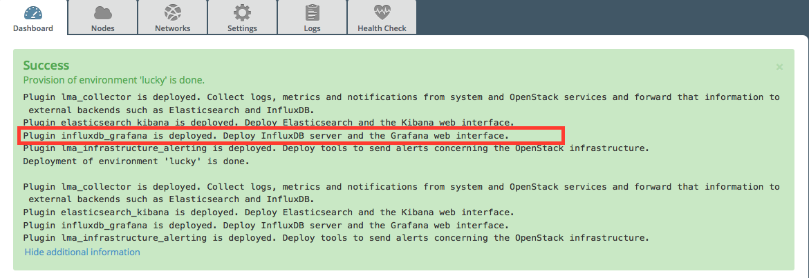
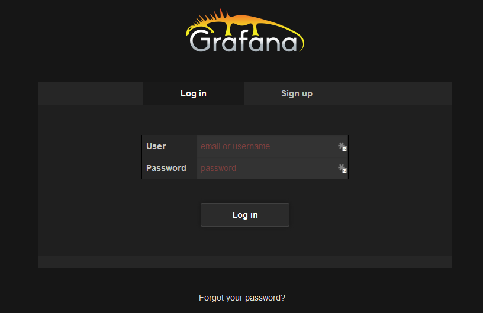
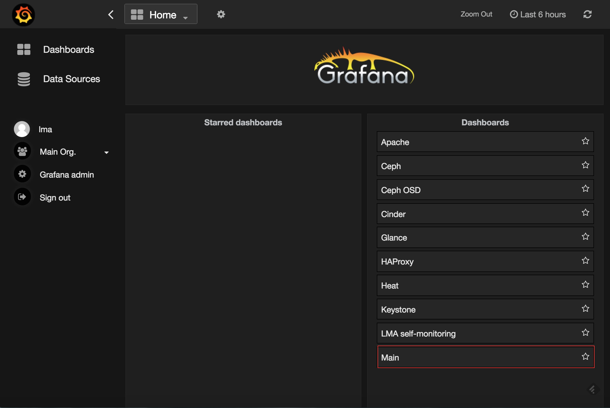

.. _verification:

Plugin verification
-------------------

Depending on the number of nodes and deployment setup, deploying a Mirantis
OpenStack environment may take 30 minutes to several hours. Once the
deployment is complete, you should see a deployment success notification
with a link to the Grafana web UI as shown below.

Verify InfluxDB
+++++++++++++++

To verify that the InfluxDB cluster is running properly, first retrieve the
InfluxDB cluster VIP address:

#. On the Fuel Master node, find the IP address of a node where the InfluxDB
   server is installed using the :command:`fuel nodes` command. For example:

   .. code-block:: console

      [root@fuel ~]# fuel nodes
      id | status   | name             | cluster | ip         | mac | roles            |
      ---|----------|------------------|---------|------------|-----|------------------|
      1  | ready    | Untitled (fa:87) | 1       | 10.109.0.8 | ... | influxdb_grafana |
      2  | ready    | Untitled (12:aa) | 1       | 10.109.0.3 | ... | influxdb_grafana |
      3  | ready    | Untitled (4e:6e) | 1       | 10.109.0.7 | ... | influxdb_grafana |

#. Log in to any of these nodes through SSH, for example, to ``node-1``
#. Run the following command:

   .. code-block:: console

      root@node-1:~# hiera lma::influxdb::vip
      10.109.1.4

   Where ``10.109.1.4`` is the virtual IP address (VIP) of your InfluxDB
   cluster.

#.  Using that VIP address, run the following command:

   .. code-block:: console

      root@node-1:~# /usr/bin/influx -database lma -password lmapass \
      --username root -host 10.109.1.4 -port 8086
      Visit https://enterprise.influxdata.com to register for updates,
      InfluxDB server management, and monitoring.
      Connected to http://10.109.1.4:8086 version 0.10.0
      InfluxDB shell 0.10.0
      >

   The example above shows that executing ``/usr/bin/influx`` starts an
   interactive CLI and automatically connects to the InfluxDB server. Then
   run the following command:

   .. code-block:: console

      > show series

   You should see a dump of all the time-series collected so far. Then run:

   .. code-block:: console

      > show servers
      name: data_nodes
      ----------------
      id      http_addr       tcp_addr
      1       node-1:8086     node-1:8088
      3       node-2:8086     node-2:8088
      5       node-3:8086     node-3:8088

      name: meta_nodes
      ----------------
      id      http_addr       tcp_addr
      1       node-1:8091     node-1:8088
      2       node-2:8091     node-2:8088
      4       node-3:8091     node-3:8088

   You should see a list of nodes participating in the `InfluxDB cluster
   <https://docs.influxdata.com/influxdb/v0.10/guides/clustering/>`_ with
   their roles (data or meta).

Verify Grafana
++++++++++++++

#. Log in to the Fuel web UI.
#. In the :guilabel:`Dashboard` tab, click :guilabel:`Grafana`. If your DNS is
   not set up, enter the IP address and the port number.
#. Authenticate using your credentials.

You should be redirected to the :guilabel:`Grafana Home Page` where you can
select a dashboard as shown below.

